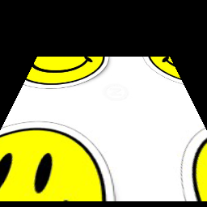
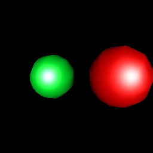

List of bundled shaders
=======================

smooth-edges
------------

&nbsp;

edge
----

Edge detection shader

&nbsp;

translate
---------

Translate texture by specifiying `x` and `y` in texture coordinates.

&nbsp;

blinn
-----

Blinn-Phong shader

&nbsp;
